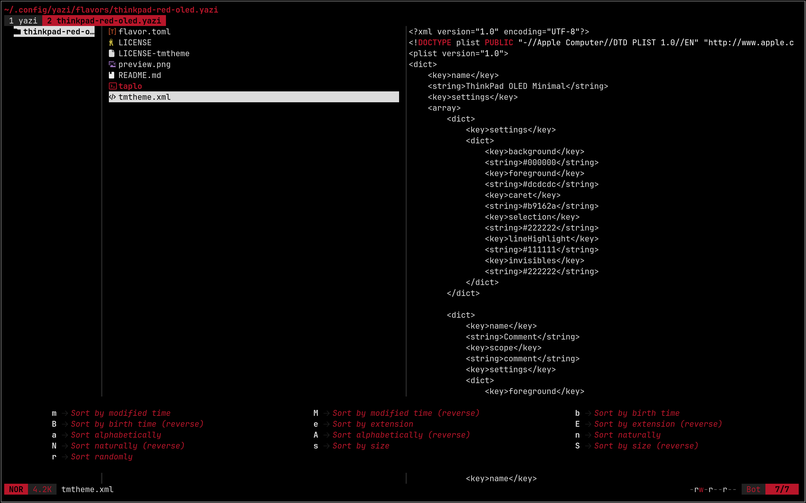

<div align="center">
  
</div>

<h3 align="center">
    ThinkPad Red OLED Flavor for <a href="https://github.com/sxyazi/yazi">Yazi</a>
</h3>

## 👀 Preview



## 🎨 Installation

```sh
ya pkg add AdmiralBarbarossa/thinkpad-red-oled.yazi
```

## ⚙️ Usage

To set it as your dark flavor, change the content of your `theme.toml` to:

```toml
[flavor]
dark = "thinkpad-red-oled"
```

Make sure your `theme.toml` doesn't contain anything other than `[flavor]`, unless you want to override certain styles of this flavor.

See the [Yazi flavor documentation](https://yazi-rs.github.io/docs/flavors/overview) for more details.

## 📜 License

The flavor is MIT-licensed, and the included tmTheme is also MIT-licensed.

Check the [LICENSE](./LICENSE) and [LICENSE-tmtheme](./LICENSE-tmtheme) files for more details.

## 🛑 Disclaimer

ThinkPad is a registered trademark of Lenovo. This project is an independent, community-created flavor designed to match the classic ThinkPad aesthetic. It is not affiliated with, endorsed by, or sponsored by Lenovo.
